<div align="center">

<a href="https://EllySantiago.github.io/NTry-find-my-honeypot-Leo/">
  
</a>

*✿ toque no monitor para abrir o terminal interativo ✿*

</div>

---

> “hoje vou lhes contar uma história, de uma pequena menina antes de encontrar uma estrelinha caída. quer ouvir uma história?”

## 📂 ls historias

```
rosita@coquette-term:~$ ls historias
```

| capítulo | mês | |
|---|---|---|
| [parte 1](partes/parte-1.md) | janeiro | ✿ |
| [parte 2](partes/parte-2.md) | fevereiro | ✿ |
| [parte 3](partes/parte-3.md) | março | ✿ |
| [parte 4](partes/parte-4.md) | abril | ✿ |
| [parte 5](partes/parte-5.md) | maio | ✿ |
| parte 6 | junho | em breve |
| parte 7 | julho | em breve |
| parte 8 | agosto | em breve |
| parte 9 | setembro | em breve |
| parte 10 | outubro | em breve |
| parte 11 | novembro | em breve |
| parte 12 | dezembro | em breve |

```
rosita@coquette-term:~$ entrar ▌
```

*…existem arquivos escondidos. Quem souber o codinome, abre no terminal.* 

## 🖥 Terminal interativo

Com comandos, sons, estações (pétalas, estrelinhas, vaga-lumes…) e temas:
**[abrir o terminal](https://EllySantiago.github.io/Try-find-my-honeypot-Leo/)**

| comando | o que faz |
|---|---|
| `ls historias` | lista as partes |
| `cd historias/parte3` ou `cd historias/marco` | lê a parte |
| `proximo` / `anterior` | navega |
| `entrar <codinome>` | abre os arquivos secretos |
| `voltar` | zera o terminal |
| `estacao <nome>` | petalas, dente, outono, inverno, estrelas, vagalumes, limpo |
| `tema <nome>` | rosa, carmesim, amber, esmeralda |


## ✍ Nova parte

1. Adicione `"6": "texto..."` em `partes` no `historias.js` (parágrafos separados por `\n\n`).
2. Crie `partes/parte-6.md` copiando o formato da parte 5 e troque `em breve` pelo link na tabela.